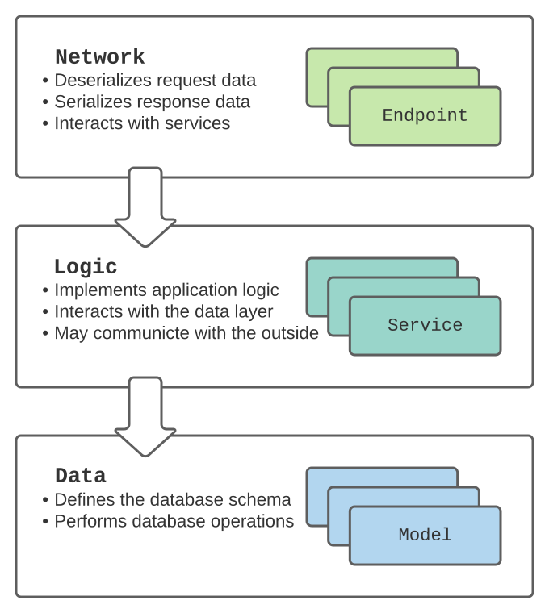

# Records

The idea of this project is to show how Starlette, Marshmallow, 
and SQLAlchemy can be combined to create a RESTful HTTP API 
application that is modular, lightweight, and capable of dealing 
with many simultaneous requests.

## Architecture

Uses a 3-tier architecture, illustrated below. 




## Setting up

Requires Python 3.9+, git, and poetry.

### Building

```
$ git clone https://github.com/rbw/records.git
$ cd records
$ poetry update
```

### Starting Postgres

The application requires an SQLAlchemy-supported relational database. This example uses pg.ARRAY in AlbumModel, making it compatible with Postgres only.

A docker-compose file for running a Postgres server is available in the project root.

```
$ docker-compose up
```

### Starting Records 

```
$ poetry shell
$ python -m records
```

## Usage

### Get all albums
```
$ curl http://localhost:5000/albums
```

### Create an album
```
$ curl -X POST --data '{"title": "test", "release_date": "2035-01-20", "stores": ["APPLE", "YOUTUBE"], "tracks": ["TEST000000001", "TEST000000002"], "upc": "00000000000005"}' http://localhost:5000/albums
```

### Show an album
```
$ curl http://localhost:5000/albums/00000000000005
```


## Todo

- Add Tracks API `[GET/POST/DELETE => /tracks,/tracks:trackid:]`
- Implement add-tracks-to-album `[POST => /albums/:albumid:/tracks]`
- Implement del-track-from-album `[DELETE => /albums/:albumid:/tracks/:trackid:]`
- Implement query filtering
- Add CLI
- Project docs
- Code docs
- Automated tests

## Funding

Consider [leaving a donation](https://paypal.vault13.org) if you like this software.

## Author

Robert Wikman \<rbw@vault13.org\>
